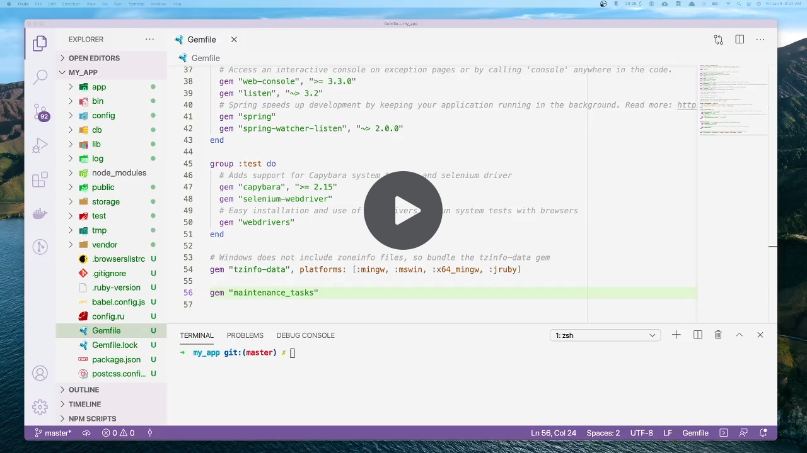

# MaintenanceTasks

A Rails engine for queuing and managing maintenance tasks.

[](https://www.youtube.com/watch?v=BTuvTQxlFzs)

## Installation

To install the gem and run the install generator, execute:

```sh-session
bundle add maintenance_tasks
bin/rails generate maintenance_tasks:install
```

The generator creates and runs a migration to add the necessary table to your
database. It also mounts Maintenance Tasks in your `config/routes.rb`. By
default the web UI can be accessed in the new `/maintenance_tasks` path.

In case you use an exception reporting service (e.g. Bugsnag) you might want to
define an error handler. See [Customizing the error
handler](#customizing-the-error-handler) for more information.

### Active Job Dependency

The Maintenance Tasks framework relies on Active Job behind the scenes to run
Tasks. The default queuing backend for Active Job is
[asynchronous][async-adapter]. It is **strongly recommended** to change this to
a persistent backend so that Task progress is not lost during code or
infrastructure changes. For more information on configuring a queuing backend,
take a look at the [Active Job documentation][active-job-docs].

[async-adapter]: https://api.rubyonrails.org/classes/ActiveJob/QueueAdapters/AsyncAdapter.html
[active-job-docs]: https://guides.rubyonrails.org/active_job_basics.html#setting-the-backend

### Autoloading

The Maintenance Tasks framework does not support autoloading in `:classic` mode.
Please ensure your application is using
[Zeitwerk](https://github.com/fxn/zeitwerk) to load your code.  For more
information, please consult the [Rails guides on autoloading and reloading
constants](https://guides.rubyonrails.org/autoloading_and_reloading_constants.html).

## Usage

The typical Maintenance Tasks workflow is as follows:

1. [Generate a class describing the Task](#creating-a-task) and the work to be done.
2. Run the Task
    - either by [using the included web UI](#running-a-task-from-the-web-ui),
    - or by [using the command line](#running-a-task-from-the-command-line),
    - or by [using Ruby](#running-a-task-from-ruby).
3. [Monitor the Task](#monitoring-your-tasks-status)
    - either by using the included web UI,
    - or by manually checking your task’s run’s status in your database.
4. Optionally, delete the Task code if you no longer need it.

### Creating a Task

A generator is provided to create tasks. Generate a new task by running:

```sh-session
bin/rails generate maintenance_tasks:task update_posts
```

This creates the task file `app/tasks/maintenance/update_posts_task.rb`.

The generated task is a subclass of `MaintenanceTasks::Task` that implements:

* `collection`: return an Active Record Relation or an Array to be iterated
  over.
* `process`: do the work of your maintenance task on a single record

Optionally, tasks can also implement a custom `#count` method, defining the
number of elements that will be iterated over. Your task’s `tick_total` will be
calculated automatically based on the collection size, but this value may be
overridden if desired using the `#count` method (this might be done, for
example, to avoid the query that would be produced to determine the size of your
collection).

Example:

```ruby
# app/tasks/maintenance/update_posts_task.rb

module Maintenance
  class UpdatePostsTask < MaintenanceTasks::Task
    def collection
      Post.all
    end

    def process(post)
      post.update!(content: "New content!")
    end
  end
end
```

### Creating a CSV Task

You can also write a Task that iterates on a CSV file. Note that writing CSV
Tasks **requires Active Storage to be configured**. Ensure that the dependency
is specified in your application’s Gemfile, and that you’ve followed the [setup
instructions][storage-setup]. See also [Customizing which Active Storage service
to use][storage-customizing].

[storage-setup]: https://edgeguides.rubyonrails.org/active_storage_overview.html#setup
[storage-customizing]: #customizing-which-active-storage-service-to-use

Generate a CSV Task by running:

```sh-session
bin/rails generate maintenance_tasks:task import_posts --csv
```

The generated task is a subclass of `MaintenanceTasks::Task` that implements:

* `process`: do the work of your maintenance task on a `CSV::Row`

```ruby
# app/tasks/maintenance/import_posts_task.rb

module Maintenance
  class ImportPostsTask < MaintenanceTasks::Task
    csv_collection

    def process(row)
      Post.create!(title: row["title"], content: row["content"])
    end
  end
end
```

```csv
# posts.csv
title,content
My Title,Hello World!
```

The files uploaded to your Active Storage service provider will be renamed
to include an ISO 8601 timestamp and the Task name in snake case format.
The CSV is expected to have a trailing newline at the end of the file.

#### Batch CSV Tasks

Tasks can process CSVs in batches. Add the `in_batches` option to your task’s
`csv_collection` macro:

```ruby
# app/tasks/maintenance/batch_import_posts_task.rb

module Maintenance
  class BatchImportPostsTask < MaintenanceTasks::Task
    csv_collection(in_batches: 50)

    def process(batch_of_rows)
      Post.insert_all(post_rows.map(&:to_h))
    end
  end
end
```

As with a regular CSV task, ensure you’ve implemented the following method:

* `process`: do the work of your Task on a batch (array of `CSV::Row` objects).

Note that `#count` is calculated automatically based on the number of batches in
your collection, and your Task’s progress will be displayed in terms of batches
(not the total number of rows in your CSV).

### Processing Batch Collections

The Maintenance Tasks gem supports processing Active Records in batches. This
can reduce the number of calls your Task makes to the database. Use
`ActiveRecord::Batches#in_batches` on the relation returned by your collection
to specify that your Task should process batches instead of records. Active
Record defaults to 1000 records by batch, but a custom size can be specified.

```ruby
# app/tasks/maintenance/update_posts_in_batches_task.rb

module Maintenance
  class UpdatePostsInBatchesTask < MaintenanceTasks::Task
    def collection
      Post.in_batches
    end

    def process(batch_of_posts)
      batch_of_posts.update_all(content: "New content added on #{Time.now.utc}")
    end
  end
end
```

Ensure that you’ve implemented the following methods:

* `collection`: return an `ActiveRecord::Batches::BatchEnumerator`.
* `process`: do the work of your Task on a batch (`ActiveRecord::Relation`).

Note that `#count` is calculated automatically based on the number of batches in
your collection, and your Task’s progress will be displayed in terms of batches
(not the number of records in the relation).

**Important!** Batches should only be used if `#process` is performing a batch
operation such as `#update_all` or `#delete_all`. If you need to iterate over
individual records, you should define a collection that [returns an
`ActiveRecord::Relation`](#creating-a-task). This uses batching internally, but
loads the records with one SQL query. Conversely, batch collections load the
primary keys of the records of the batch first, and then perform an additional
query to load the records when calling `each` (or any `Enumerable` method)
inside `#process`.

### Tasks that don’t need a Collection

Sometimes, you might want to run a Task that performs a single operation, such
as enqueuing another background job or hitting an external API. The gem supports
collection-less tasks.

Generate a collection-less Task by running:

```sh-session
bin/rails generate maintenance_tasks:task no_collection_task --no-collection
```

The generated task is a subclass of `MaintenanceTasks::Task` that implements:

* `process`: do the work of your maintenance task

```ruby
# app/tasks/maintenance/no_collection_task.rb

module Maintenance
  class NoCollectionTask < MaintenanceTasks::Task
    no_collection

    def process
      SomeAsyncJob.perform_later
    end
  end
end
```

### Throttling

Maintenance Tasks often modify a lot of data and can be taxing on your database.
The gem provides a throttling mechanism that can be used to throttle a Task when
a given condition is met. If a Task is throttled, it will be interrupted and
retried after a backoff period has passed. The default backoff is 30 seconds.
Specify the throttle condition as a block:

```ruby
# app/tasks/maintenance/update_posts_throttled_task.rb

module Maintenance
  class UpdatePostsThrottledTask < MaintenanceTasks::Task
    throttle_on(backoff: 1.minute) do
      DatabaseStatus.unhealthy?
    end

    def collection
      Post.all
    end

    def process(post)
      post.update!(content: "New content added on #{Time.now.utc}")
    end
  end
end
```

Note that it’s up to you to define a throttling condition that makes sense for
your app. Shopify implements `DatabaseStatus.healthy?` to check various MySQL
metrics such as replication lag, DB threads, whether DB writes are available,
etc.

Tasks can define multiple throttle conditions. Throttle conditions are inherited
by descendants, and new conditions will be appended without impacting existing
conditions.

The backoff can also be specified as a Proc:

```ruby
# app/tasks/maintenance/update_posts_throttled_task.rb

module Maintenance
  class UpdatePostsThrottledTask < MaintenanceTasks::Task
    throttle_on(backoff: -> { RandomBackoffGenerator.generate_duration } ) do
      DatabaseStatus.unhealthy?
    end
    ...
  end
end
```

### Custom Task Parameters

Tasks may need additional information, supplied via parameters, to run.
Parameters can be defined as Active Model Attributes in a Task, and then become
accessible to any of Task’s methods: `#collection`, `#count`, or `#process`.

```ruby
# app/tasks/maintenance/update_posts_via_params_task.rb

module Maintenance
  class UpdatePostsViaParamsTask < MaintenanceTasks::Task
    attribute :updated_content, :string
    validates :updated_content, presence: true

    def collection
      Post.all
    end

    def process(post)
      post.update!(content: updated_content)
    end
  end
end
```

Tasks can leverage Active Model Validations when defining parameters. Arguments
supplied to a Task accepting parameters will be validated before the Task starts
to run. Since arguments are specified in the user interface via text area
inputs, it’s important to check that they conform to the format your Task
expects, and to sanitize any inputs if necessary.

### Using Task Callbacks

The Task provides callbacks that hook into its life cycle.

Available callbacks are:

* `after_start`
* `after_pause`
* `after_interrupt`
* `after_cancel`
* `after_complete`
* `after_error`

```ruby
module Maintenance
  class UpdatePostsTask < MaintenanceTasks::Task
    after_start :notify

    def notify
      NotifyJob.perform_later(self.class.name)
    end

    # ...
  end
end
```

Note: The `after_error` callback is guaranteed to complete,
so any exceptions raised in your callback code are ignored.
If your `after_error` callback code can raise an exception,
you’ll need to rescue it and handle it appropriately
within the callback.

```ruby
module Maintenance
  class UpdatePostsTask < MaintenanceTasks::Task
    after_error :dangerous_notify

    def dangerous_notify
      # This error is rescued in favour of the original error causing the error flow.
      raise NotDeliveredError
    end

    # ...
  end
end
```

If any of the other callbacks cause an exception,
it will be handled by the error handler,
and will cause the task to stop running.

Callback behaviour can be shared across all tasks using an initializer.

```ruby
# config/initializer/maintenance_tasks.rb
Rails.autoloaders.main.on_load("MaintenanceTasks::Task") do
  MaintenanceTasks::Task.class_eval do
    after_start(:notify)

    private

    def notify; end
  end
end
```

### Considerations when writing Tasks

MaintenanceTasks relies on the queue adapter configured for your application to
run the job which is processing your Task. The guidelines for writing Task may
depend on the queue adapter but in general, you should follow these rules:

* Duration of `Task#process`: processing a single element of the collection
  should take less than 25 seconds, or the duration set as a timeout for Sidekiq
  or the queue adapter configured in your application. It allows the Task to be
  safely interrupted and resumed.
* Idempotency of `Task#process`: it should be safe to run `process` multiple
  times for the same element of the collection. Read more in [this Sidekiq best
  practice][sidekiq-idempotent]. It’s important if the Task errors and you run
  it again, because the same element that errored the Task may well be processed
  again. It especially matters in the situation described above, when the
  iteration duration exceeds the timeout: if the job is re-enqueued, multiple
  elements may be processed again.

[sidekiq-idempotent]: https://github.com/mperham/sidekiq/wiki/Best-Practices#2-make-your-job-idempotent-and-transactional

#### Task object life cycle and memoization

When the Task runs or resumes, the Runner enqueues a job, which processes the
Task. That job will instantiate a Task object which will live for the duration
of the job. The first time the job runs, it will call `count`. Every time a job
runs, it will call `collection` on the Task object, and then `process`
for each item in the collection, until the job stops. The job stops when either the
collection is finished processing or after the maximum job runtime has expired.

This means memoization can be misleading within `process`, since the memoized
values will be available for subsequent calls to `process` within the same job.
Still, memoization can be used for throttling or reporting, and you can use [Task
callbacks](#using-task-callbacks) to persist or log a report for example.

### Writing tests for a Task

The task generator will also create a test file for your task in the folder
`test/tasks/maintenance/`. At a minimum, it’s recommended that the `#process`
method in your task be tested. You may also want to test the `#collection` and
`#count` methods for your task if they are sufficiently complex.

Example:

```ruby
# test/tasks/maintenance/update_posts_task_test.rb

require "test_helper"

module Maintenance
  class UpdatePostsTaskTest < ActiveSupport::TestCase
    test "#process performs a task iteration" do
      post = Post.new

      Maintenance::UpdatePostsTask.process(post)

      assert_equal "New content!", post.content
    end
  end
end
```

### Writing tests for a CSV Task

You should write tests for your `#process` method in a CSV Task as well. It
takes a `CSV::Row` as an argument. You can pass a row, or a hash with string
keys to `#process` from your test.

```ruby
# test/tasks/maintenance/import_posts_task_test.rb

require "test_helper"

module Maintenance
  class ImportPostsTaskTest < ActiveSupport::TestCase
    test "#process performs a task iteration" do
      assert_difference -> { Post.count } do
        Maintenance::UpdatePostsTask.process({
          "title" => "My Title",
          "content" => "Hello World!",
        })
      end

      post = Post.last
      assert_equal "My Title", post.title
      assert_equal "Hello World!", post.content
    end
  end
end
```

### Writing tests for a Task with parameters

Tests for tasks with parameters need to instantiate the task class in order to
assign attributes. Once the task instance is setup, you may test `#process`
normally.

```ruby
# test/tasks/maintenance/update_posts_via_params_task_test.rb

require "test_helper"

module Maintenance
  class UpdatePostsViaParamsTaskTest < ActiveSupport::TestCase
    setup do
      @task = UpdatePostsViaParamsTask.new
      @task.updated_content = "Testing"
    end

    test "#process performs a task iteration" do
      assert_difference -> { Post.first.content } do
        task.process(Post.first)
      end
    end
  end
end
```

### Running a Task

#### Running a Task from the Web UI

You can run your new Task by accessing the Web UI and clicking on "Run".

#### Running a Task from the command line

Alternatively, you can run your Task in the command line:

```sh-session
bundle exec maintenance_tasks perform Maintenance::UpdatePostsTask
```

To run a Task that processes CSVs from the command line, use the `--csv` option:

```sh-session
bundle exec maintenance_tasks perform Maintenance::ImportPostsTask --csv "path/to/my_csv.csv"
```

The `--csv` option also works with CSV content coming from the standard input:

```sh-session
curl "some/remote/csv" |
  bundle exec maintenance_tasks perform Maintenance::ImportPostsTask --csv
```

To run a Task that takes arguments from the command line, use the `--arguments`
option, passing arguments as a set of \<key>:\<value> pairs:

```sh-session
bundle exec maintenance_tasks perform Maintenance::ParamsTask \
  --arguments post_ids:1,2,3 content:"Hello, World!"
```

#### Running a Task from Ruby

You can also run a Task in Ruby by sending `run` with a Task name to Runner:

```ruby
MaintenanceTasks::Runner.run(name: "Maintenance::UpdatePostsTask")
```

To run a Task that processes CSVs using the Runner, provide a Hash containing an
open IO object and a filename to `run`:

```ruby
MaintenanceTasks::Runner.run(
  name: "Maintenance::ImportPostsTask",
  csv_file: { io: File.open("path/to/my_csv.csv"), filename: "my_csv.csv" }
)
```

To run a Task that takes arguments using the Runner, provide a Hash containing
the set of arguments (`{ parameter_name: argument_value }`) to `run`:

```ruby
MaintenanceTasks::Runner.run(
  name: "Maintenance::ParamsTask",
  arguments: { post_ids: "1,2,3" }
)
```

### Monitoring your Task’s status

The web UI will provide updates on the status of your Task. Here are the states
a Task can be in:

* **new**: A Task that has not yet been run.
* **enqueued**: A Task that is waiting to be performed after a user has
  instructed it to run.
* **running**: A Task that is currently being performed by a job worker.
* **pausing**: A Task that was paused by a user, but needs to finish work before
  stopping.
* **paused**: A Task that was paused by a user and is not performing. It can be
  resumed.
* **interrupted**: A Task that has been momentarily interrupted by the job
  infrastructure.
* **cancelling**: A Task that was cancelled by a user, but needs to finish work
  before stopping.
* **cancelled**: A Task that was cancelled by a user and is not performing. It
  cannot be resumed.
* **succeeded**: A Task that finished successfully.
* **errored**: A Task that encountered an unhandled exception while performing.

### How Maintenance Tasks runs a Task

Maintenance tasks can be running for a long time, and the purpose of the gem is
to make it easy to continue running tasks through deploys, [Kubernetes Pod
scheduling][k8s-scheduling], [Heroku dyno restarts][heroku-cycles] or other
infrastructure or code changes.

[k8s-scheduling]: https://kubernetes.io/docs/concepts/scheduling-eviction/
[heroku-cycles]: https://www.heroku.com/dynos/lifecycle

This means a Task can safely be interrupted, re-enqueued and resumed without any
intervention at the end of an iteration, after the `process` method returns.

By default, a running Task will be interrupted after running for more 5 minutes.
This is [configured in the `job-iteration` gem][max-job-runtime] and can be
tweaked in an initializer if necessary.

[max-job-runtime]: https://github.com/Shopify/job-iteration/blob/-/guides/best-practices.md#max-job-runtime

Running tasks will also be interrupted and re-enqueued when needed. For example
[when Sidekiq workers shuts down for a deploy][sidekiq-deploy]:

[sidekiq-deploy]: https://github.com/mperham/sidekiq/wiki/Deployment

* When Sidekiq receives a TSTP or TERM signal, it will consider itself to be
  stopping.
* When Sidekiq is stopping, JobIteration stops iterating over the enumerator.
  The position in the iteration is saved, a new job is enqueued to resume work,
  and the Task is marked as interrupted.

When Sidekiq is stopping, it will give workers 25 seconds to finish before
forcefully terminating them (this is the default but can be configured with the
`--timeout` option). Before the worker threads are terminated, Sidekiq will try
to re-enqueue the job so your Task will be resumed. However, the position in
the collection won’t be persisted so at least one iteration may run again.

#### Help! My Task is stuck

Finally, if the queue adapter configured for your application doesn’t have this
property, or if Sidekiq crashes, is forcefully terminated, or is unable to
re-enqueue the jobs that were in progress, the Task may be in a seemingly stuck
situation where it appears to be running but is not. In that situation, pausing
or cancelling it will not result in the Task being paused or cancelled, as the
Task will get stuck in a state of `pausing` or `cancelling`. As a work-around,
if a Task is `cancelling` for more than 5 minutes, you will be able to cancel it
for good, which will just mark it as cancelled, allowing you to run it again.

### Configuring the gem

There are a few configurable options for the gem. Custom configurations should
be placed in a `maintenance_tasks.rb` initializer.

#### Customizing the error handler

Exceptions raised while a Task is performing are rescued and information about
the error is persisted and visible in the UI.

If you want to integrate with an exception monitoring service (e.g. Bugsnag),
you can define an error handler:

```ruby
# config/initializers/maintenance_tasks.rb

MaintenanceTasks.error_handler = ->(error, task_context, _errored_element) do
  Bugsnag.notify(error) do |notification|
    notification.add_metadata(:task, task_context)
  end
end
```

The error handler should be a lambda that accepts three arguments:

* `error`: The exception that was raised.
* `task_context`: A hash with additional information about the Task and the
  error:
  * `task_name`: The name of the Task that errored
  * `started_at`: The time the Task started
  * `ended_at`: The time the Task errored

  Note that `task_context` may be empty if the Task produced an error before any
  context could be gathered (for example, if deserializing the job to process
  your Task failed).
* `errored_element`: The element, if any, that was being processed when the Task
  raised an exception. If you would like to pass this object to your exception
  monitoring service, make sure you **sanitize the object** to avoid leaking
  sensitive data and **convert it to a format** that is compatible with your bug
  tracker. For example, Bugsnag only sends the id and class name of Active
  Record objects in order to protect sensitive data. CSV rows, on the other
  hand, are converted to strings and passed raw to Bugsnag, so make sure to
  filter any personal data from these objects before adding them to a report.

#### Customizing the maintenance tasks module

`MaintenanceTasks.tasks_module` can be configured to define the module in which
tasks will be placed.

```ruby
# config/initializers/maintenance_tasks.rb

MaintenanceTasks.tasks_module = "TaskModule"
```

If no value is specified, it will default to `Maintenance`.

#### Customizing the underlying job class

`MaintenanceTasks.job` can be configured to define a Job class for your tasks to
use. This is a global configuration, so this Job class will be used across all
maintenance tasks in your application.

```ruby
# config/initializers/maintenance_tasks.rb

MaintenanceTasks.job = "CustomTaskJob"

# app/jobs/custom_task_job.rb

class CustomTaskJob < MaintenanceTasks::TaskJob
  queue_as :low_priority
end
```

The Job class **must inherit** from `MaintenanceTasks::TaskJob`.

Note that `retry_on` is not supported for custom Job classes, so failed jobs
cannot be retried.

#### Customizing the rate at which task progress gets updated

`MaintenanceTasks.ticker_delay` can be configured to customize how frequently
task progress gets persisted to the database. It can be a `Numeric` value or an
`ActiveSupport::Duration` value.

```ruby
# config/initializers/maintenance_tasks.rb

MaintenanceTasks.ticker_delay = 2.seconds
```

If no value is specified, it will default to 1 second.

#### Customizing which Active Storage service to use

The Active Storage framework in Rails 6.1 and up supports multiple storage
services. To specify which service to use,
`MaintenanceTasks.active_storage_service` can be configured with the service’s
key, as specified in your application’s `config/storage.yml`:

```yaml
# config/storage.yml

user_data:
  service: GCS
  credentials: <%= Rails.root.join("path/to/user/data/keyfile.json") %>
  project: "my-project"
  bucket: "user-data-bucket"

internal:
  service: GCS
  credentials: <%= Rails.root.join("path/to/internal/keyfile.json") %>
  project: "my-project"
  bucket: "internal-bucket"
```

```ruby
# config/initializers/maintenance_tasks.rb

MaintenanceTasks.active_storage_service = :internal
```

There is no need to configure this option if your application uses only one
storage service. `Rails.configuration.active_storage.service` is used by
default.

#### Customizing the backtrace cleaner

`MaintenanceTasks.backtrace_cleaner` can be configured to specify a backtrace
cleaner to use when a Task errors and the backtrace is cleaned and persisted.
An `ActiveSupport::BacktraceCleaner` should be used.

```ruby
# config/initializers/maintenance_tasks.rb

cleaner = ActiveSupport::BacktraceCleaner.new
cleaner.add_silencer { |line| line =~ /ignore_this_dir/ }

MaintenanceTasks.backtrace_cleaner = cleaner
```

If none is specified, the default `Rails.backtrace_cleaner` will be used to
clean backtraces.

## Upgrading

Use bundler to check for and upgrade to newer versions. After installing a new
version, re-run the install command:

```sh-session
bin/rails generate maintenance_tasks:install
```

This ensures that new migrations are installed and run as well.

**What if I’ve deleted my previous Maintenance Task migrations?**

The install command will attempt to reinstall these old migrations and migrating
the database will cause problems. Use `bin/rails
maintenance_tasks:install:migrations` to copy the gem’s migrations to your
`db/migrate` folder. Check the release notes to see if any new migrations were
added since your last gem upgrade. Ensure that these are kept, but remove any
migrations that already ran.

Run the migrations using `bin/rails db:migrate`.

## Contributing

Would you like to report an issue or contribute with code? We accept issues and
pull requests. You can find the contribution guidelines on
[CONTRIBUTING.md][contributing].

[contributing]: https://github.com/Shopify/maintenance_tasks/blob/main/.github/CONTRIBUTING.md

## Releasing new versions

Updates should be added to the latest draft release on GitHub as Pull Requests
are merged.

Once a release is ready, follow these steps:

* Update `spec.version` in `maintenance_tasks.gemspec`.
* Run `bundle install` to bump the `Gemfile.lock` version of the gem.
* Open a PR and merge on approval.
* Deploy via [Shipit][shipit] and see the new version on
  <https://rubygems.org/gems/maintenance_tasks>.
* Ensure the release has documented all changes and publish it.
* Create a new [draft release on GitHub][release] with the title “Upcoming
  Release”. The tag version can be left blank. This will be the starting point
  for documenting changes related to the next release.

[release]: https://help.github.com/articles/creating-releases/
[shipit]: https://shipit.shopify.io/shopify/maintenance_tasks/rubygems
